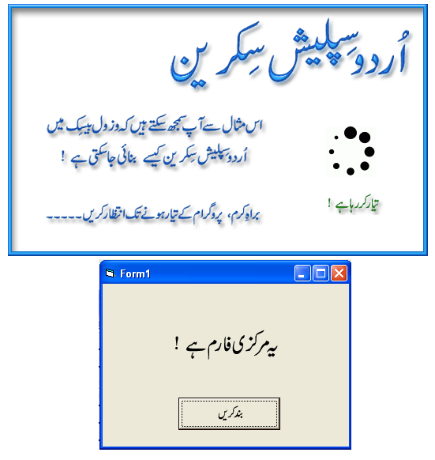



## Urdu Splash Screen \(Animated\)

### Description

This is Urdu Splash Screen sample project. You can understand by this project that how you can generate Urdu Splash Screens for VB6 applications. A GIF file playing class also included in this project. With this class, you can easily make Animated Splash Screens for Urdu VB6 applications. I hope you all will like this. Like before, Waiting for you Feedback at my E-Mail Address. Thank You.

 Join Urdu Programming at Facebook 

 http://www.facebook.com/pages/Urdu-Programming-VB6/263338567072301 
 
### More Info
 

             |
---                |---
**Submitted On**   |2011-07-04 11:33:46
**By**             |[Mehmood Iqbal](https://github.com/Planet-Source-Code/PSCIndex/blob/master/ByAuthor/mehmood-iqbal.md)
**Level**          |Intermediate
**User Rating**    |4.5 (18 globes from 4 users)
**Compatibility**  |VB 6\.0
**Category**       |[Coding Standards](https://github.com/Planet-Source-Code/PSCIndex/blob/master/ByCategory/coding-standards__1-43.md)
**World**          |[Visual Basic](https://github.com/Planet-Source-Code/PSCIndex/blob/master/ByWorld/visual-basic.md)
**Archive File**   |[Urdu\_Splas2208277162011\.zip](https://github.com/Planet-Source-Code/mehmood-iqbal-urdu-splash-screen-animated__1-73866/archive/master.zip)

